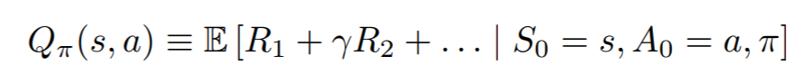
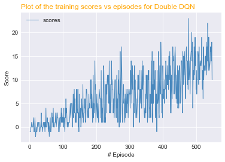

# Reinforcement learning to solve the navigation problem

This repo presents three solutions to the continuous control navigation problem using a unity environment

## Learning Environment

The environment is a continuous control navigation problem; the goal is to collect the maximum number of yellow bananas in the area during a set maximum number of moves. 
To make things more of a challenge the play area also contains some blue bananas which provide a point penalty. A reward of +1 is provided for collecting a yellow banana, and a reward of -1 is provided for collecting a blue banana.

There are four possible actions associated with the environment.

* 0 - move forward.
* 1 - move backward.
* 2 - turn left.
* 3 - turn right.

In order to solve the environment, your agent must get an average score of +13 over 100 consecutive episodes.

The state space has 37 dimensions and contains information about the agents proximity to the objects around it, along with its velocity.

### Project dependencies

Project dependencies are listed in the requirements.txt file.
Please also follow the instructions to install the unity ml environment
https://github.com/Unity-Technologies/ml-agents/blob/master/docs/Installation.md

## Q-Learning
An agent in Q learning works by observing the state (some numerical representation of its current environment) and makes a decision on an action to take in order to maximise its reward. How does it achieve this?

We define the optimal action-value function  as the maximum expected return achievable by following any strategy, after seeing some state s and then taking some action a [1]

This means that given a state of the game s, Q(s,a) is the best (discounted) total return the agent can achieve if it performs action a in the current state.

So how do we chose this action? Well one strategy may be to always pick the action with the highest likelihood of providing the maximum return. There are some problems with this however, namely in the early stages of training
we don't know the optimal action and actions tested early for a given state may be perpetuated in later stages of training. This can be fixed however by finding a balance between exploration, where the agent tries new actions and exploitation, where the agent performs the action it believes optimal ## Vanilla DQN

If we are in state s and the network choses action a and we know the Q values for all actions in the next state if action a is performed then the Q value for the state action pair would be the expected reward for performing action a plus a discounted expected return in the next state

The most basic implementation in this repo is the vanilla DQN. Finding the optimal policy is defined as the expected sum of future rewards when taking that action and following the optimal policy

Where gamma is the discount factor that normalises the importance of immediate reward. S is the state, A is the action and R is the reward.

The action in the vanilla DQN is estimated using feed forward neural network containing two latent layers. The input size to the feed forward net is 37 corresponding to the size of the state space and each hidden layer has less hidden units to prevent overfitting and relu activation functions.

We also use fixed Q targets when updating the parameters in the model using a temporary copy of the local neural network which is periodically updated with the weights of the local network.

w prime is a copy of the local network weights called the 'target network' in the code.

##Double DQN

It has previously been noted that the Q-learning algorithm can overestimate action values under certain conditions [2]. The max operator in vanilla Q-learning uses the same parameters both to select and evaluate actions. 
Double Q learning attempts to fix this by decoupling the selection and evaluation with two separate networks, local and target which are periodically synced.

##Dueling  DQN

In dueling networks, instead of directly predicting a Q value for each action, the network splits the final layer in two, representing the value V(a) and advantage functions A(s,a) that predict a particular state value that depends on the state and action advantages A(s,a) that depend on the state and respective action.

In order to combine the the value and advantage stream into Q-values Q(s,a) we do the following:

## Running the models

The notebook file Report.ipynb provides example code on how to run the agents.

## Results

Below are the graphs for the three methods tried in this project.

## References

[1] Playing Atari with Deep Reinforcement Learning
https://arxiv.org/abs/1312.5602

[2] Deep Reinforcement Learning with Double Q-learning
https://arxiv.org/pdf/1509.06461.pdf